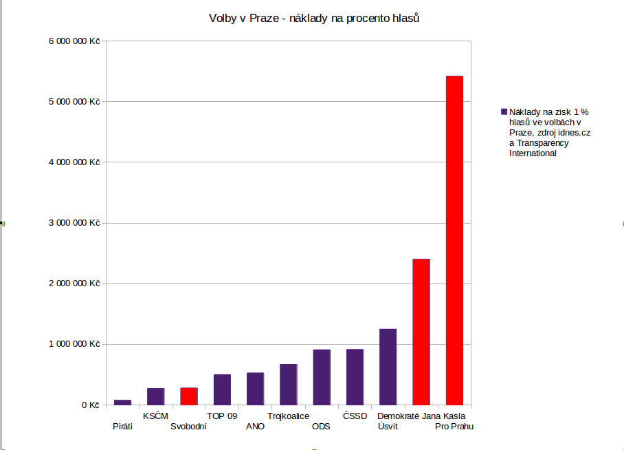
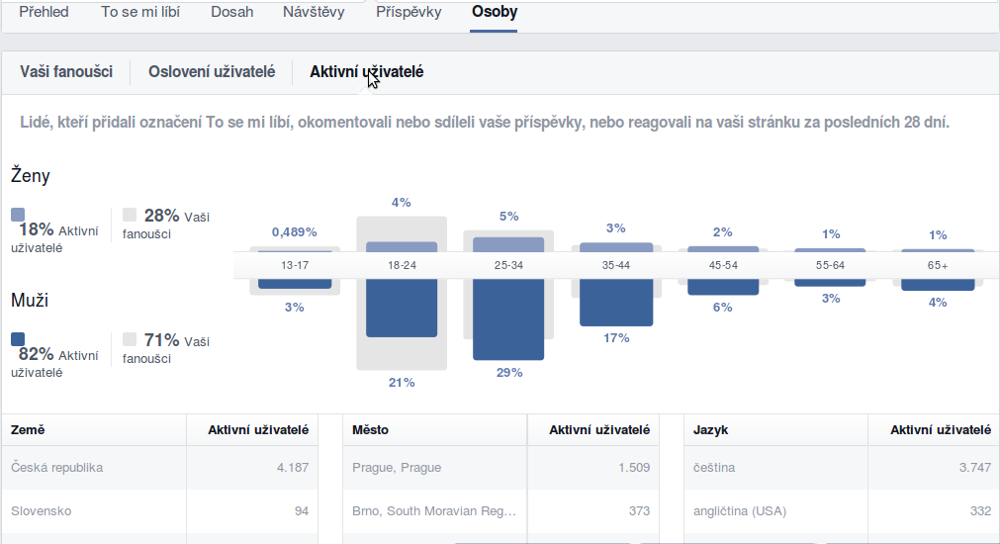
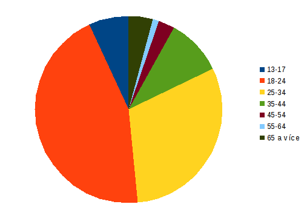
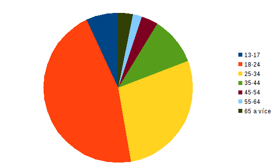
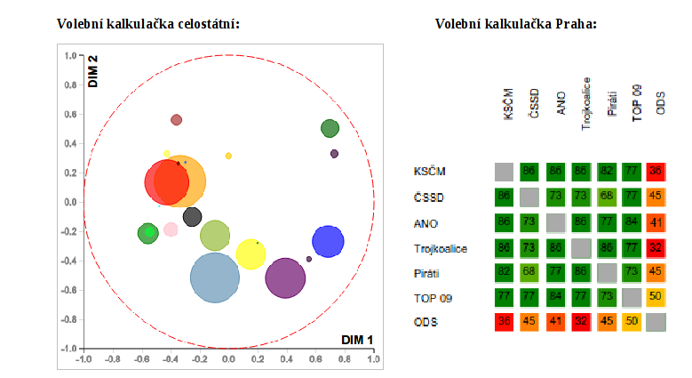
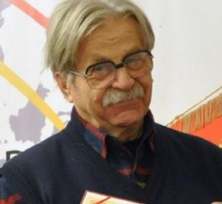
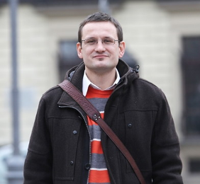

# Famózní ediální strategie

## 1. Úvod

Famózní mediální strategie je dokument zastupitelského klubu Pirátů, jehož cílem je popsat voličskou podporu Pirátů v Praze a navrhnout konkrétní opatření, jak do budoucna vylepšit komunikaci zastupitelského klubu Pirátů s médii i příznivci. 

## 2. Analytická část

### a) Volební výsledky a podpora

Voličská podpora Pirátů se v Praze pohybuje stabilně okolo 5 %, z velkých městských částí byla slabší Praha 8, naopak výsledek na Praze 1 dokazuje, že kampaň funguje. 

Volební výsledky Pirátů podle městských částí: [http://www.pirat.ly/m4q79](http://www.pirat.ly/m4q79)

Výběr z tabulky ukazuje podle hlasů nejlepší a nejhorší výsledky (Hlasy, procenta, MČ)

|hlasů|procent|městská část|
|-----|-----|-----|
|106256|5.03 %|Praha 4|
|99985|5.08 %|Praha 6|	
|91934|5.59 %|Praha 10|	
|76942|5.60 %|Praha 11|	
|73009|4.28 %|Praha 8|	
|67781|5.29 %|Praha 5|	
|64778|6.04 %|Praha 3|	
|57347|6.00 %|Praha 13|	
|46207|5.27 %|Praha 12|	
|44693|6.21 %|Praha 2|	
|41983|6.01 %|Praha 7|	
|34103|4.68 %|Praha 9|	
|31518|6.67 %|Praha 1|	
|30564|5.32 %|Praha 14|	
|28030|5.48 %|Praha 15|	
|21907|5.72 %|Praha 17|	
|16438|6.13 %|Praha 18|
|2793|4.45%|Praha-Slivenec|
|2737|4.87%|Praha-Nebušice|
|2321|3.74%|Praha-Lipence|
|2272|4.51%|Praha-Dolní Měcholupy|
|2106|4.49%|Praha-Běchovice|
|2008|2.87%|Praha-Šeberov|
|1691|4.73%|Praha-Štěrboholy|
|1174|5.47%|Praha-Křeslice|
|1158|4.97%|Praha-Březiněves|
|1157|4.01%|Praha-Troja|
|1049|2.56%|Praha-Koloděje|
|1008|3.61%|Praha-Lysolaje|
|783|4.58%|Praha-Benice|
|778|7.20%|Praha-Přední Kopanina|
|652|4.28%|Praha-Lochkov|
|68|1.07%|Praha-Královice|
|65|0.68%|Praha-Nedvězí|

Dobré výsledky vykazují Piráti v centru Prahy a v takzvaném širším centru Prahy. Horší výsledky naopak ukazují na malých městských částech. Výjimkou jsou Praha 8 a Praha 9, kde Piráti nezaznamenali dobrý výsledek. Na Praze 9 chyběla lokální kandidátka. Na Praze 8 byla extrémně slabá kandidátka a patrně byla podceněna kampaň v Bohnicích. Poučení z toho je, že si musíme dát pozor na velká sídliště, která nejsou zasažena kampaní v metru.

V početnějších městských částech (graf 1, část vlevo) je výsledek stabilnější. Dosáhl zde 5-6 % hlasů. V menších městských částech klesá a podléhá větším výkyvům. Nejnižší výsledky zaznamenaly městské části Praha-Nedvězí (cca 300 obyvatel), Praha-Královice, Praha-Koloděje a Praha-Šeberov. 

#### Jak ovlivňují výsledek kandidátky v městských částech?

Kampaň v městských částech má jednoznačný vliv na celkové výsledky voleb. Dobrým příkladem je Praha 1 a především Praha Klánovice, kde jsme zaznamenali výrazně nadprůměrné výsledky. Praha 8  naopak dokládá, že není nutné kandidovat za každou cenu a působit jako exoti. Obecně lze konstatovat, že kandidatura v městské části (a to i v rámci koalice, pokud je to spojené s dostatečnou viditelností) působí pozitivně na volební výsledky. 

#### Které části kampaně byly rozhodující?

Pro hlubší analýzu dopadu jednotlivých částí kampaně na volební výsledek nám chybí potřebná data, ale ledacos se dá odhadnout. Klíčová je zjevně účast v televizních debatách a prezence v tisku (bez nich nemá šanci ani kampaň velikosti Pro Prahu, nebo Jana Kasla). Měřitelný zásah měla ještě letákovací kampaň na Praze 1 (která přinesla v daném obvodu odhadem 1 % hlasů navíc) a jednoznačně fungovalo i rozdávání volebních novin. To dokládám větší úspěšností Pirátů v centru města oproti okrajovým městským částem. Na druhou stranu nižší úspěšnost Pirátů v okrajových částech může být způsobena i odlišnou demografií. Měli jsme výrazně aktivnější kontaktní kampaň než Svobodní a bylo to znát (mimochodem v Eurovolbách to bylo naopak a také to bylo znát). 

#### Jaké jsou potřeby obyvatel (co vnímají, že by pro ně měli dělat politici), a jaké to má důsledky pro výběr komunikovaných témat?

Tímto způsobem ke kampani přistoupilo hnutí Pro Prahu (témata špinavých chodníků a dopravních zácp) a nemám pocit, že by se to osvědčilo. Problémem bylo, že lidé musí také věřit, že je politická strana schopna s tím něco udělat.

Doporučuji vybrat témata, která zajímají nás, jsme v nich kompetentní a současně jsou zajímavá a relevantní pro občany Prahy. Současně je na místě mít základní odpovědi na všechny relevantní témata Prahy, jako jsme se snažili zpracovat pro minulé volby (mýtné v centru, dostavba metra, čistička odpadních vod atp.)

#### Proč nás lidé volí? 

Osobně mám za to, že věří, že přispějeme tomu, aby bylo dobře spravováno město. Prosazujeme otevřenost. Ať jim to tam ti mladí nandají. Do budoucna bychom to měli lépe prozkoumat. 

### b) Efektivita kampaně

Piráti měli nejlevnější a nejefektivnější kampaň do voleb, a to řádově. Voliči chtěli volit radikálně a proti zavedeným strukturám, což dokazuje také volební výsledek strany Svobodných, která na komunální volby vyčlenila jen milion korun a jako jediná se alespoň vzdáleně blíží v ceně nákladů na 1 voliče k Pirátům. 

### c) Facebookoví fanoušci Pirátů

**Data z našeho celostranického Facebooku:**
 
* Zajímají se o nás spíše muži než ženy, v poměru cca 3:1
* Zajímají se o nás především lidé pod 40 a nad 60 let
* V Praze máme cca 13 700 fanoušků
* Jádro našich aktivních podporovatelů je ve věku 25-34 let
* Největší skupina našich fanoušků je ve věku 18-24 let

Mám za to, že skupina 40 až 60 let si už zažila revoluci, jsou ostře vymezení proti komunismu a jsou nejvíce zastoupení v politice (je to ta generace, která je u moci, nechce předávat žezlo). 

**Rozložení věkových skupin, muži**

**Rozložení věkových skupin, ženy**

### d) Pirátský program v porovnání s dalšími stranami

Analýza programové blízkosti našich voličů podle kohovolit.eu: [záznam přednášky](https://vimeo.com/119948412), [slajdy](https://docs.google.com/presentation/d/1TklWjQ9_6p-BGuXNyXdXhlwHAmSoG8acIoHymkWDHyY/edit#slide=id.p)

Na pravolevé ose jsme mezi ČSSD a ANO blíže k ČSSD, blízko nás jsou ještě Zelení a Usvit. Nejdále jsme od ODS, TOP 09 a Svobodných. Názory stran Piráti a Svobodní jsou většinou velmi rozdílné, ale v několika tématech mají velmi blízké voliče.

Odkaz na pražskou volební kalkulačku, karta porovnání: [http://www.pirat.ly/f34p5](http://www.pirat.ly/f34p5)

Blízkost programová - Trojkoalice, ČSSD, ANO, KSČM
Vzdálenější jsme od TOP 09

Pirátský protipól v rámci Prahy je ODS

Pozor, ČSSD a ANO jsou totální pragmatici, program je nezajímá

Velký potenciál pro získání nových voličů máme především v elektorátu ANO (které je na politické scéně nové) a TOP 09 (která je silně oslabená vnitřním rozpadem). Přebírat hlasy můžeme i trojkoalici, která má ovšem pravděpodobně stabilnější voličské jádro i stranické vedení. 

### e) Prototypoví voliči (persony)

a) Pavla Červenková, 

Studentka 1. ročníku VŠ, věk: 20 let

Konzumentka **konopí**, zajímá se o **liberální** témata. Sleduje filmy, kopíruje počítačové programy a nesouhlasí s **autorským právem**. Většina jiných politických stran jí přijde nesrozumitelná a odtažitá od jeho světa. Neztotožňuje se s pravo-levým viděním světa a **nerozumí** obecně fungování politiky.

b) Jaroslav Šikl

Senior, liberálně zaměřený, věk 64 let

**Nesouhlasí se současnou politickou reprezentací.** Pravici považuje za příliš konzervativní a korupční, levici za příliš byrokratickou a odtaženou od reálného světa. Neorientuje se příliš v IT tématech, nicméně má zájem o prosazení **transparentnosti** a radikální společenskou **změnu**.

c) Vojtěch Tománek

Ajťák, zelený/geek, věk 34 let.

Pracuje v malé firmě jako jediný správce IT, příležitostně učí na střední škole. Občas přichází s originálními nápady. Má **nízké příjmy**, odmítá velké společnosti z principu a zajímá se otevřeně o techniku. Podporuje **open source**. Je zaměřený **altruisticky, liberálně** a politicky mírně levicově. Jiným politickým stranám nevěří, neboť se domnívá, že nemají zájem o obyčejného člověka. 

d) Hana Rybálková

alternativně zaměřená žena, věk 35 let.

Ostře se vymezuje proti **velkým společnostem** (farmaceutické, technologické, ropné aj). Často věří v **konspirační teorie**. Nevolí zelené, neboť je považuje za kolaboranty velkého byznysu. Zajímá se o alternativní **lékařství**, bojuje proti **očkování** a prosazuje **biopotraviny**. Je jí blízké hnutí new-age. Patří k nízkopříjmovým vrstvám.

e) Ondřej Blažej

mírně levicový liberál, věk 28 let.

**Studuje** doktorské studium, je živnostník a má svojí **první práci**. Obává se, že by se musel kompromitovat se systémem, který považuje za **zkažený**. Je mu blízký **aktivismus**, zajímá se o **politiku**. Rád bloguje a píše články o dění kolem sebe. Znepokojuje ho propojení byznysu a politiky; často má detailní přehled o fungování politiky. O technologie se zajímá jen do míry nezbytné pro komunikaci s ostatními. Má střední příjmy. 

## 3. Doporučující část

### a) Cíle mediální strategie

**Hlavní cíl**

Propagovat aktivity Pirátských zastupitelů a vytvořit dobrou výchozí pozici pro to, aby Piráti získali v Praze aspoň 10 % v komunálních volbách v roce 2018 a měli možnost prosazovat Pirátská témata v rámci vyjednávání povolební koalice.

**Dílčí cíle:**

* kvalitně prezentovat názory a aktivity Pirátské strany především v Praze 
* rozšířit okruh lidí, kteří se o Piráty zajímají a pomáhají jim (utvořit kolem klubu hejno aktivistů) 
* zachovat si i v mediální činnosti zásady, se kterými jsme do politiky vstoupili

### b) Zásady mediální činnosti Pirátů

**Klíčové výchozí dokumenty:**

Pirátská identita: [http://www.pirati.cz/rp/pid/start](http://www.pirati.cz/rp/pid/start) 
Pirátský klíč: [http://www.pirati.cz/rp/pid/klic](http://www.pirati.cz/rp/pid/klic)

1. Neděláme PR pro PR - cíl žádné naší akce nesmí být čistě: "být v novinách" je potřeba dostávat se do novin kvůli prezentovaným tématům.
2. Jsme poctiví - nelžeme, vyhýbáme se demagogii, neděláme podpásovky, posíláme podněty kritizovaným
3. Máme oporu v realitě - neslibujeme nesplnitelné, nepožadujeme nereálné
4. Jsme konstruktivní - vždy pokud je to možné navrhujeme vlastní alternativy či návrhy na zlepšení
5. PR si odmakáme - primárně medializujeme naše činy, návrhy řešení a požadavky, nejsme pouze komentátory
6. Pracujeme na sobě - potřebujeme pracovat na tom, aby se naše výstupy zlepšovaly. Držet laťku nestačí
7. Jsme tým - Nejde o to vypěstovat z nás celebrity, ale o značku Pirátů - klubu i strany
8. Máme nadhled - jsme nad věcí, nebereme si věci osobně, nejsme hysterky
9. Informujeme - prezentujeme informace, nejsme Blesk (alespoň ne příliš často)
10. Provokujeme - nebojíme se provokovat, nebo třeba dělat věci, které nikdo dříve nedělal – nejsme svazáci, ať to od nás nikdo nečeká
11. Jsme otevření - Nesyslíme si podklady, analýzy ani informace pro sebe. Sdílíme s novináři i s veřejností
12. Máme svůj styl - jsme osobití, nebojíme se jít proti proudu, nechceme splynout se systémem

### c) Témata profilace

Hlavní téma: **otevřenost**
Hlavní protivník: **staré struktury**
Zásady sebeprezentace

* věcnost
* kreativita
* mládí a energie

Každý zastupitel se dlouhodobě a systematicky profiluje v jednom až třech tématech. Každý zastupitel by si měl vytvářet svůj mediální profil, který bude dlouhodobý a zapamatovatelný. 

**Jakub:** právník (přístup k informacím, pražské kauzy)
**Ondra:** IT specialista (kyberaktivista, opendata, svobodný software)
**Mikuláš:** aktivista (uzemní plán, svobodomyslnost – busking, protialkoholní vyhláška...)
**Adam:** analytik (otevřená radnice, protikorupční opatření, dotace)

### d) Konkrétní kroky

#### Šablony, infrastruktura, sdílení

* Hlásíme se k naší značce Pirátské strany, nosíme trička, vyvěšujeme vlajky apod. – jediná strana, jejíž tričko se člověk nemusí stydět nosit

* Vytvořit grafickou prezentaci a šablony pro všechny druhy výstupů (grafickou identitu), která zapadá do prezentace strany (viz trička strany a vlajky), podle seznamu:

 * plakát pro zastupitelské úterky,
 * newsletter e-mail (pilot: černobílý newsletter pdf pro tisk A4),
 * komix se stejným pozadím a měnícím se obsahem, 
 * tisková zpráva,
 * leták prezentující činnost Pirátů,
 * volební noviny.

* Musíme nechat dost prostoru pro kreativitu.
* Sdílet grafické návrhy na gitu.

#### Plánování

* vytvořit pražský mediaplán
* udržovat mediaplán, pravidelný bod jednání klubu
* při plánování činnosti vždy myslet i na medializaci

#### Komunikace s médii

* 2 x týdně poslat do médií vlastní zprávu 
* posílat shrnutí před zastupitelstvem - nabrífovat z Pirátského pohledu,
* jednotlivé zastupitele profilovat tak, aby je v dané oblasti novináři oslovovali s žádostí o reakci
* 1 x za 14 dní zkusit větší mediální zásah - větší kauza bude určena na jednání klubu, kontaktovat individuálně známé novináře
* získávat od zastupitelů z městských částí informace o jejich kauzách. Tyto informace budeme šířit i přes naše kanály
* Hlídat, že veškerá relevantní činnost je současně dostatečně prezentovaná
* upgradnout medialist, maillist na krátká vyjádření, udržovat medialist press centrum na webu
* Identifikovat témata, co hýbou městem a vydávat k nim krátká vyjádření (swarm monitoring – vlákno na fóru s přeposíláním)
* zkusit zapojit dobrovolníky do TZ chystaných v předstihu
* volat do TV v zásadních kauzách

#### Komunikace vlastními kanály a využití dobrovolníků

* Vybudovat základnu aktivních příznivců, o které půjde opřít kampaň a crowdsourcing, a to i v městských částech, rozmyslet, kde se budou rojit
* 1 x měsíčně newsletter (kolem zastupitelstva), možnost přihlásit se na Mail-Chimp
* alespoň 1 x týdně blog k aktuálnímu tématu na webu Pirátů Praha, sdílet přes sociální sítě strany i individuální
* Na facebooku rozvíjet pražskou page Pirátské strany, důležité věci protlačit na facebook celostranický, individuálně šířit na facebooku přes profily zastupitelů a podporovatelů, na facebooku zohlednit i méně politická témata, abychom přitáhli ženy
* Udržovat živý twitter profil
* Rozjet denně aktualizované Pirátské listy (Mikuláš sestaví tým lidí, které to bude bavit) alespoň jednou do roka, ideálně dvakrát, vydat tištěné noviny v nákladu přinejmenším 50 000 ks (využít startovač, začít asi na podzim)
* Kromě toho udělat alespoň jednu další offline kampaň
udržet a propagovat zastupitelská úterý zejména mezi členy 
* pravidelné návštěvy institucí, které je jinak náročnější zasáhnout - každý zastupitel navštíví aspoň 1 instituci měsíčně (školy, domovy seniorů apod.) - vytvořit univerzální plakát na akci, univerzální prezentaci, klást důraz na konverzi směrem k dobrovolníkům (co mohou dělat užitečného pro šíření Pirátských myšlenek a stát se dlouhodobými sympatizanty)
* žádat podporovatele o umístění odkazu nebo banneru na naše stránky, vystavení plakátu v prodejně, loga nebo odkazu na web či FB, nalepení na auto, novinová distribuční/čtenářská místa, fyzický newsletter
* využívat toho, že můžeme jít do konfliktu s koalicí
* plné využití okna a dveří (týmový duch, pohoda, výzva zapojte se, plakáty)

#### Vystupování na veřejných jednáních

* klást „hloupé“ otázky
* aktivně vystupovat
* prezentovat všechny podivnosti, na které jsme narazili
* nenechat se stírat ani umlčet
* mít dobře zvládnutý jednací řád
* nenechat se vyvést z míry
* mít připravené „hlášky“ ovšem k tématu
* rozmyslet si ke komu mluvíme (primátorka/koalice/veřejnost), přímo oslovovat koaliční radní
* zamyslet se nad tím, jak reagovat na ODS a TOP 09

### e) Web

#### Hlavní cíle návštěvníků x cíle Pirátů

Zjistit, co jsou pražští Piráti x Sdělit, co mají občané z toho, že jsou na Magistrátu Piráti

#### Co chtějí občané od webu?

* Kdo jsou pirátští zastupitelé?
* Zjistit, co pirátští zastupitelé dělají.
* Proč zrovna Piráti? (až v předvolebním období – vyjádření příznivců, memegenerator)
* Co zastupitelé udělali pro občany? Úspěchy klubu.
* Možnost pravidelně informovat
* Informace o akcích, možnosti zapojení, lobbing

#### Co chceme my od webu?

* Aby lidé volili Piráty
* Aby se lidé zapojovali do pirátské činnosti, aktivismem, členstvím nebo finančně.

#### Čtyři skupiny potenciálních návštěvníků webu

SEE/THINK/BUY/CARE

1. see – ty, kteří se na stránky chtějí pouze podívat
2. think – přicházejí po jistém zamyšlení
3. buy – ti, kteří přicházejí nakoupit. V podání politické strany to jsou voliči, nebo fanoušci
4. care – ti, kteří mají o stranu zájem – cítí se součástí komunity

#### Doporučení pro web

* diskuse pod články
* newsletter
* výzvy k zapojení a spolupráci
* informace pro členy a o sdružení
* propojení se sociálními sítěmi
* press kit
* anglická podstránka
* rozcestník na městské části
